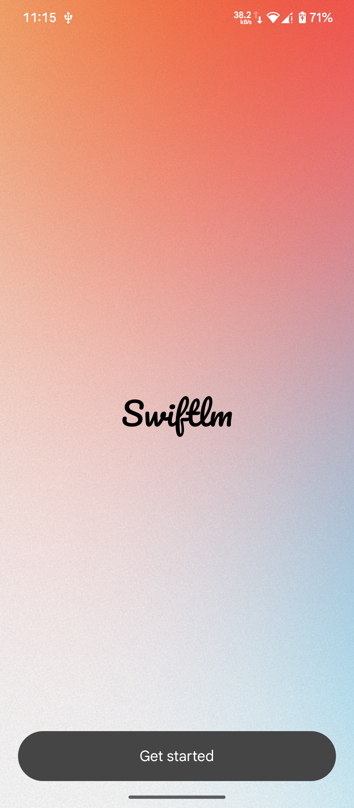
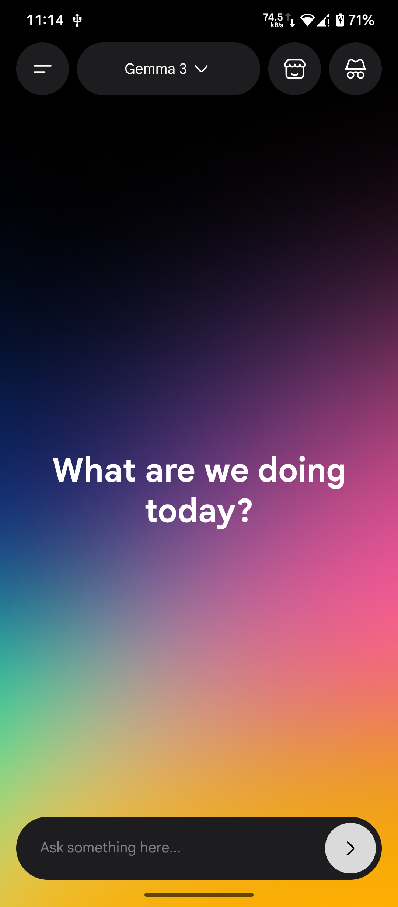
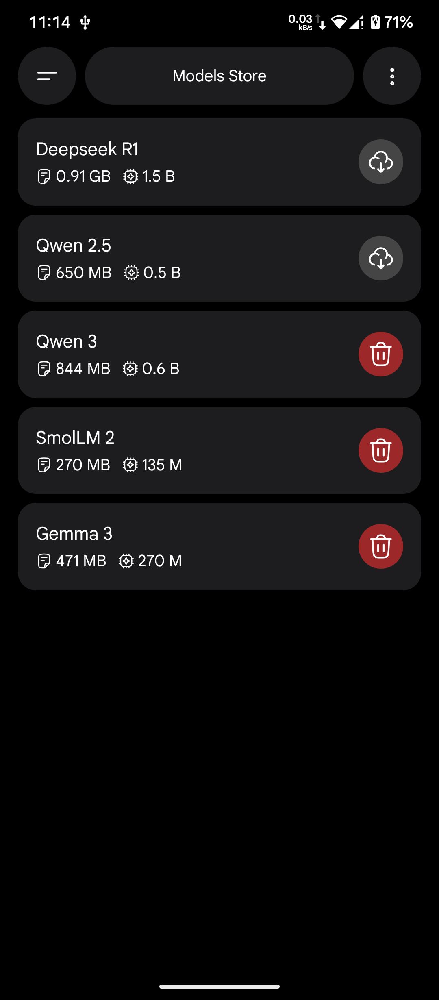
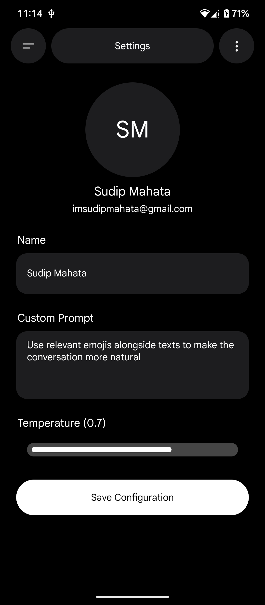
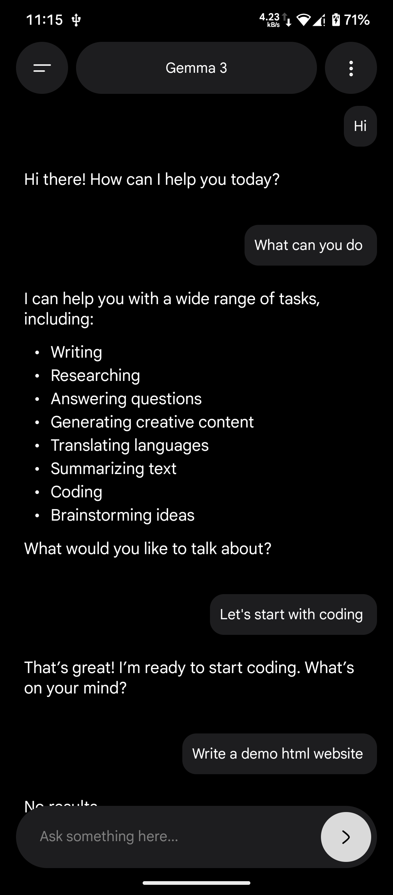
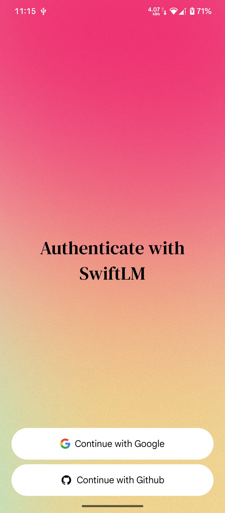

# Swift LM (swiftie)

SwiftLM is an offline AI chatbot for low end devices where you can download AI models from our models store and use it fully offline. You can even download higer param models like 7B but your device is your limit.

# Description
SwiftLM (also known as Swiftie) is an offline AI chatbot designed to run fully on-device, even on low-end Android devices. It allows users to download and run local AI models (GGUF) directly on their phone, without requiring an internet connection, API keys, or cloud servers.

The app focuses on privacy, accessibility, and efficiency. All model inference happens locally using optimized quantized LLMs, making SwiftLM usable in low-connectivity environments while keeping user data completely private.

SwiftLM includes a built-in model store, where users can choose from lightweight models under 500MB for smooth performance, or experiment with larger models (including 7B) depending on their device’s hardware limits. Responses are generated token-by-token, providing a real-time chat experience similar to online AI assistants.

Built with React Native and powered by llama.rn, SwiftLM explores the practical limits of running modern LLMs on mobile devices, balancing performance, model size, and user experience.

Key highlights

- Fully offline AI chatbot
- Runs entirely on-device (no servers, no API keys)
- Download and manage GGUF models locally
- Optimized for low-end devices, scalable to larger models
- Real-time streaming responses
- Privacy-first design

> SwiftLM is an experimental project aimed at exploring on-device AI and making local language models more accessible on mobile platforms.

# Releases

[Download](https://github.com/imsudipcreator/swift-lm/releases)

# Swiftie Icon

# Screenshots

